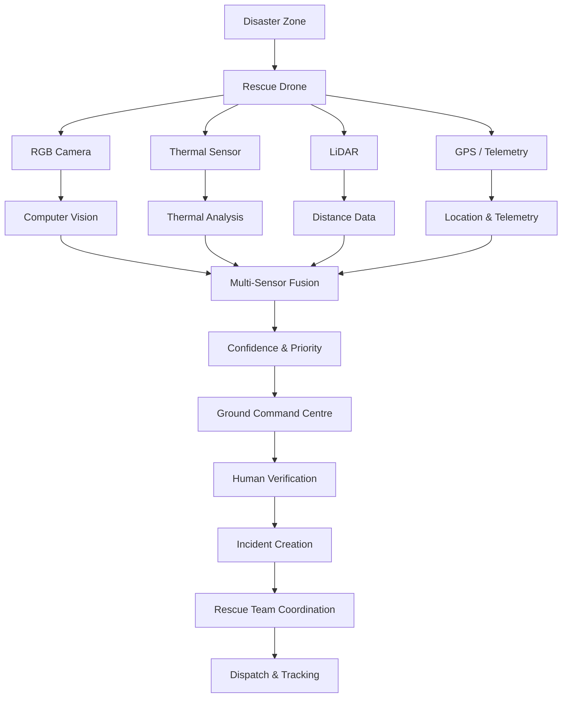
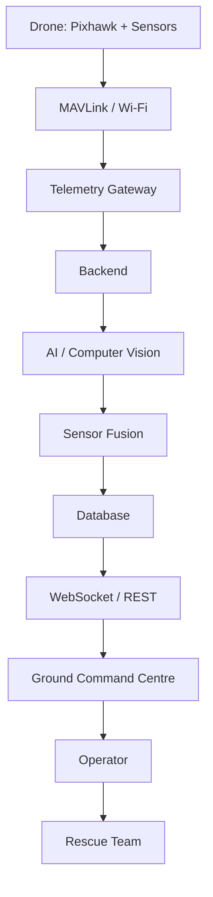

# 🚁 ResQDrone

### AI-Assisted Search & Rescue Drone Command Platform

> **AI detects. Sensors validate. Humans decide. Rescue teams act.**

ResQDrone is a drone-based search-and-rescue platform that fuses live telemetry, RGB vision, thermal sensing, LiDAR and GPS into a single Ground Command Centre. It is built to help rescue teams find survivors faster in disaster zones and hazardous terrain where manual search is slow and dangerous.

<p align="center">
  
  
  
  
  
  
  
</p>

---

## Problem

Search-and-rescue operations after disasters face the same recurring obstacles:

- Search areas are large, unstructured and often unsafe for ground teams to enter quickly.
- Visibility is limited by rubble, smoke, vegetation or darkness.
- Survivors may be partially hidden or invisible to a standard RGB camera.
- Thermal, visual and positional data are captured by different systems and rarely combined in real time.
- Coordination between spotting, verification and dispatch is manual and slow.
- Communication links (network, cloud, GPS) frequently degrade during disasters, breaking situational awareness at the worst possible time.

The result is delayed detection, delayed verification, and delayed rescue.

---

## Solution

ResQDrone treats search-and-rescue as a pipeline — from raw sensor data to a dispatched rescue team — with a human decision at its center:

```text
Disaster Zone
      ↓
Drone Deployment
      ↓
RGB + Thermal + LiDAR + GPS
      ↓
Telemetry & Sensor Processing
      ↓
Computer Vision Detection
      ↓
Multi-Sensor Fusion
      ↓
Confidence & Priority
      ↓
Ground Command Centre
      ↓
Human Verification
      ↓
Incident & Rescue Coordination
```

> ResQDrone does not automatically classify an AI detection as a confirmed survivor. The final decision remains with the human operator.

---

## Key Capabilities

### 🛰️ Drone Telemetry
GPS position, altitude, heading, speed, battery and flight status, streamed live.

### 👁️ Multi-Sensor Detection
RGB camera, thermal sensor, LiDAR and GPS feed a unified detection pipeline.

### 🤖 Computer Vision
Person detection and visual analysis performed on the drone's camera feed.

### 🌡️ Thermal Detection
Thermal signature analysis to support detection in low-visibility and low-light conditions.

### 🧠 Sensor Fusion
Combines RGB, thermal, LiDAR and location data to raise or lower detection confidence.

### 🗺️ GIS Intelligence
Live drone position, search-area coverage and detection geolocation on an operational map.

### 🚑 Rescue Coordination
Operator verification, incident creation, team recommendation and dispatch tracking.

### 📡 Communication Resilience
Independent monitoring of drone link, GPS, internet and cloud connectivity, with offline event queuing.

### 📊 Mission Analytics
Coverage area, distance flown, flight time, detections, incidents and operational events.

---

## System Flow



---

## System Architecture



---

## AI / Computer Vision Models

### Person Detection — **YOLOv8**
Used for detecting people and potential survivors in RGB camera frames.

### Image Processing — **OpenCV**
Handles frame preprocessing, image transformations and general computer-vision operations.

### Thermal Analysis — **AMG8833 thermal-grid processing**
Processes the AMG8833's thermal matrix for heat-signature analysis. The AMG8833 is a sensor, not an AI model.

### Sensor Fusion
A fusion layer combines:
- YOLOv8 detection confidence
- Thermal signature
- LiDAR distance
- GPS coordinates
- Drone telemetry

to derive a single detection confidence score and operational priority.

### Deep Learning Framework — **PyTorch**
Used for model inference and training.

> **Integration status:** YOLOv8, PyTorch-based inference and live sensor fusion are **Planned / Integration Targets**. The current frontend prototype simulates this pipeline for the Ground Command Centre demo; it does not run live model inference.

---

## Hardware

| Component | Purpose |
|---|---|
| Pixhawk 2.4.8 | Flight control |
| ArduPilot | Flight-control firmware |
| u-blox NEO GPS | Position tracking |
| ESP32-CAM | RGB imaging |
| OV2640 | Camera sensor |
| AMG8833 | Thermal sensing |
| TF-Luna LiDAR | Distance / altitude sensing |
| ESP32 | Sensor communication |

---

## Communication

```text
Pixhawk
   │
 MAVLink
   ↓
Telemetry Gateway
   │
   ├── UART → Sensors
   └── Wi-Fi → Camera / Sensor Data
                 ↓
              Backend
                 ↓
        REST API + WebSocket
                 ↓
        Ground Command Centre
```

Core protocols: **MAVLink**, **UART / TELEM**, **Wi-Fi**, **REST API**, **WebSocket**.

---

## Technology Stack

| Frontend | Backend | Computer Vision / AI | GIS | Hardware |
|---|---|---|---|---|
| React 18 | Python | YOLOv8 | React-Leaflet | Pixhawk 2.4.8 |
| TypeScript | FastAPI | PyTorch | OpenStreetMap | ArduPilot |
| Vite | WebSocket | OpenCV | GeoJSON | u-blox NEO GPS |
| Tailwind CSS | PostgreSQL | NumPy | GPS / geospatial calculations | ESP32-CAM |
| React Router | Redis | AMG8833 thermal processing | | OV2640 |
| React-Leaflet | SQLAlchemy | | | AMG8833 |
| Recharts | Pydantic | | | TF-Luna |
| Axios | | | | |
| Socket.IO Client | | | | |
| Lucide React | | | | |

The frontend stack above is implemented in the current prototype. The backend, GIS-processing and hardware layers are targeted for the integration phase.

---

## Ground Command Centre

The Ground Command Centre is the operator-facing interface for the entire mission. It brings together:

- Live mission map
- Drone telemetry
- RGB and thermal payload views
- AI detection panel
- Search-area coverage
- Incident management
- Rescue-team coordination
- Mission statistics
- System health indicators

<p align="center">
  
  <br>
  <sub>Ground Command Centre — live mission map, telemetry and system status</sub>
</p>

<p align="center">
  
  
  <br>
  <sub>AI Detection &nbsp;•&nbsp; Rescue Dispatch</sub>
</p>

---

## Prototype / Integration Status

| Layer | Status |
|---|---|
| Ground Command Centre | Prototype |
| Mission & telemetry simulation | Prototype |
| GIS visualization | Prototype |
| Detection workflow | Prototype |
| Rescue coordination workflow | Prototype |
| Pixhawk integration | Integration |
| Real sensor ingestion | Integration |
| Backend API | Integration |
| YOLOv8 inference | Integration Target |
| Thermal analysis | Integration Target |
| Multi-sensor fusion | Integration Target |
| Database | Integration Target |

---

## 🏆 SIH 2026

ResQDrone is designed as an integrated search-and-rescue platform connecting:

**Drone → Sensors → Computer Vision → Sensor Fusion → GIS → Command Centre → Human Decision → Rescue Coordination**

> **Detect → Verify → Prioritize → Dispatch → Rescue**