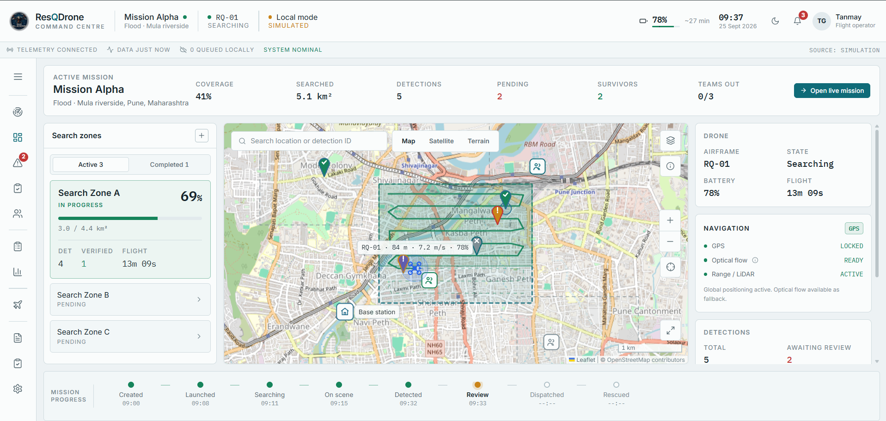
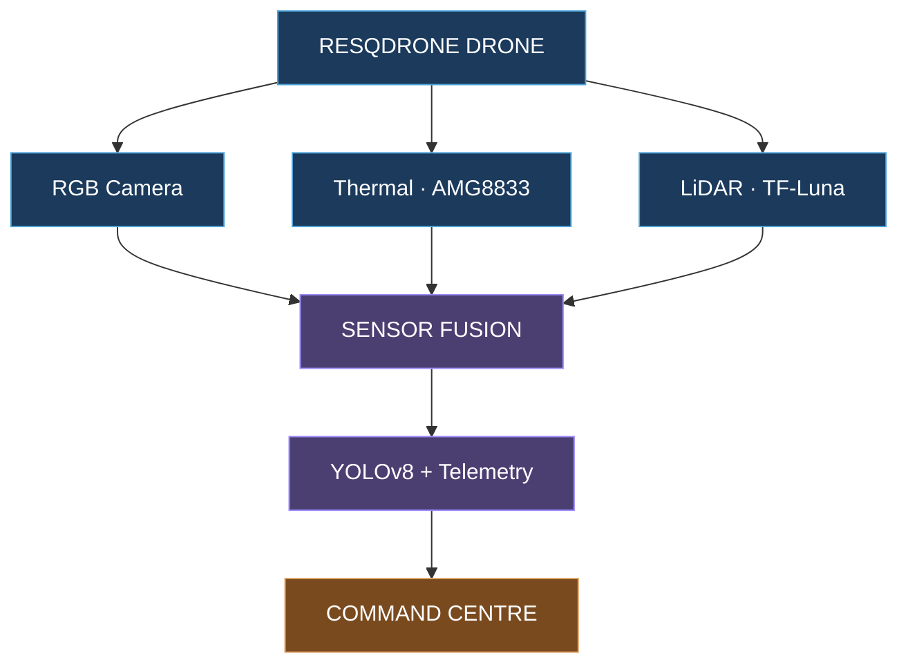
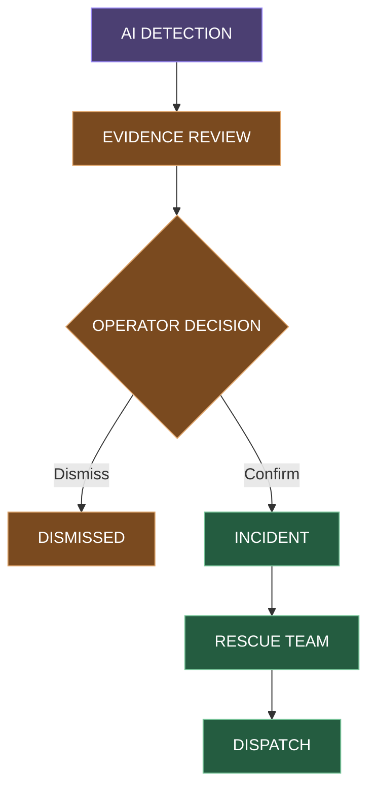
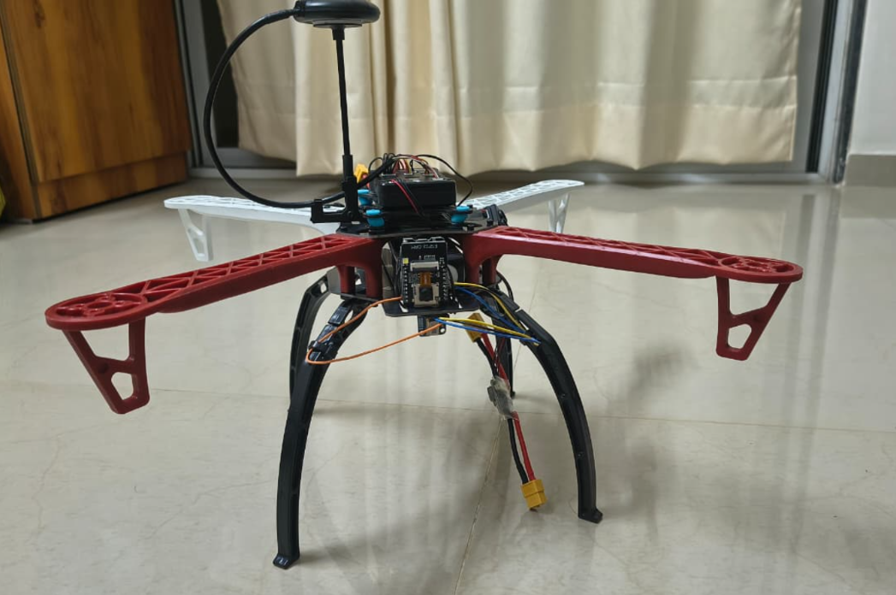
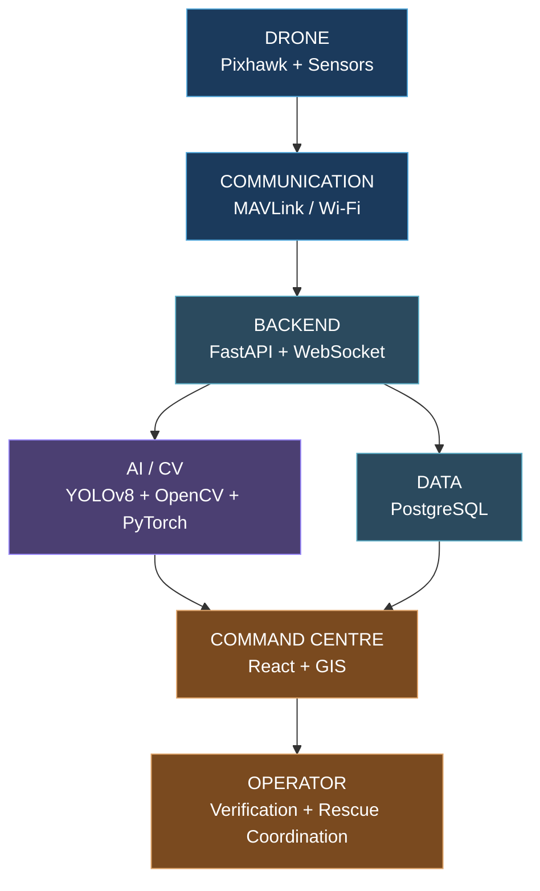

# 🚁 ResQDrone

### AI-Assisted Search & Rescue Drone Command Platform

> **AI detects. Operators verify. Rescue teams act.**

ResQDrone turns a UAV's sensor feed into rescue-ready intelligence. It combines drone telemetry,
thermal and visual sensing, and AI-assisted detection with a Ground Command Centre built for one
rule: **a human always makes the final call.**

---

## The Problem

Search-and-rescue teams operate under conditions that work against them:

- Search zones are large and often hazardous to cover on foot
- Visibility is poor — smoke, debris, dense terrain, night operations
- Survivors can be hidden from plain sight but still detectable by heat
- Visual, thermal and position data arrive from different sources, not one view
- Manual coordination between spotting and dispatch costs critical time

## Our Solution

ResQDrone pairs a sensor-equipped UAV with computer vision and a unified Ground Command Centre.
Drone telemetry, RGB vision, thermal imaging, LiDAR and GPS are fused into a single candidate
detection, prioritized by confidence, and presented to a rescue operator alongside a live map and
sensor evidence. The operator reviews that evidence and decides — the system never dispatches on
its own.

> **AI proposes a detection; the human operator makes the final decision.**

---

## System in Action

  

<em>Ground Command Centre — live mission monitoring, mapping and rescue operations.</em>

---

## Main Workflow

## Sensor → AI → Command Centre

---

## AI / Computer Vision

**YOLOv8** — person detection from RGB frames
**OpenCV** — image and video preprocessing
**PyTorch** — deep-learning framework
**AMG8833** — 8×8 thermal-grid sensing for heat signatures
**Sensor Fusion** — combines RGB, thermal, LiDAR, GPS and telemetry into one candidate detection
and priority signal

The detection pipeline above is designed and prototyped in software; live YOLOv8 inference and
sensor hardware are integration targets, listed honestly in the status table below.

---

## Human-in-the-Loop Workflow

> **AI assists the operator; it does not replace the operator.**

---

## Hardware

| Component | Purpose |
|---|---|
| Pixhawk 2.4.8 | Flight control |
| ArduPilot | Flight firmware |
| u-blox NEO GPS | Position |
| ESP32-CAM + OV2640 | RGB vision |
| AMG8833 | Thermal sensing |
| TF-Luna LiDAR | Distance |
| ESP32 | Sensor communication |

  

<strong>ResQDrone hardware — assembled UAV platform</strong>

---

## Ground Command Centre

- Live map with drone position and coverage
- Drone telemetry
- RGB and thermal views
- Detection intelligence
- Incident management
- Rescue coordination
- Mission analytics
- System health

---

## System Architecture

---

## Technology Stack

| Category | Technologies |
|---|---|
| Hardware | UAV, GPS, RGB, Thermal, LiDAR |
| Embedded & Control | C/C++, ESP32, Flight Control, GPS |
| AI & Computer Vision | Python, OpenCV, YOLO, Thermal Analysis |
| Backend | Node.js, Express.js, FastAPI, GPS Data, Telemetry |
| Web Dashboard | React, TypeScript, Tailwind CSS, Live Video, Maps |
| Cloud & Data | Cloud Storage, Real-Time Database, Authentication, Logging |

---

## Implementation Status

| Component | Status |
|---|---|
| Ground Command Centre | Prototype |
| Telemetry Simulation | Prototype |
| GIS Interface | Prototype |
| Detection Workflow | Prototype |
| Rescue Workflow | Prototype |
| Backend | Integration |
| Pixhawk / MAVLink | Integration |
| Hardware Sensors | Integration |
| YOLOv8 | Integration Target |
| Sensor Fusion | Integration Target |
